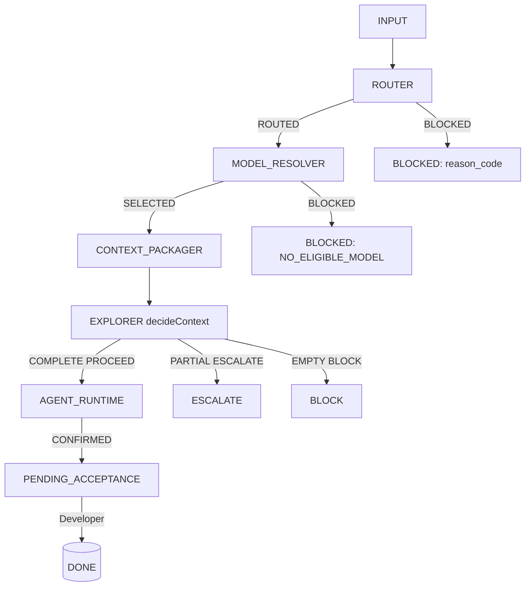

# Informe teórico: roles y gobierno de contexto — tecnotron-ai (AI Core = FitFlow-ai)

**Alcance y método.** Diseño teórico, no implementación. Fuentes canónicas leídas primero
(`AGENTS.md`, `docs/SOURCE_OF_TRUTH.md`, `operational-architecture.md`, `context-strategy.md`,
`task-lifecycle.md`, `current-state.md`, `implementation-roadmap.md`, `architecture.md`), luego
registries v3 + contratos + componentes (`router`, `model-resolver`, `finops`, `explorer`,
`agent-runtime`, `agent-mvp`, `state-machine`, `context-packager`). No se usó Codebase Memory: el
descubrimiento no fue necesario tras fuentes canónicas y código real. Cada conclusión lleva etiqueta
`VERIFIED` / `INFERENCE` / `UNKNOWN` / `BLOCKED`.

**Nota de nomenclatura (VERIFIED).** El checkout local se llama `FitFlow-ai` pero el remote es
`tecnotron-ai` (`git remote -v`). Los docs canónicos hablan de "FitFlow-ai" como AI Core.
`roles.yaml`, `models.yaml`, `finops.yaml`, `orchestrator.yaml` son *owned by FitFlow*
(`docs/SOURCE_OF_TRUTH.md:33`; `docs/tasks/FF-AI-VNEXT-008/TASK.md:117`), no viven en este repo. El
schema ejecutable sí está en `src/registries/schemas/`.

---

## 1. Mapa de roles actual

Estado real, actor, autoridad, entradas, salidas, límites y dependencia de modelo. Basado en
`roles.yaml` + routing policy + contratos.

| Rol | Estado | Actor | Escritura | Criticality ceiling | Invocación real | Depende de modelo |
| --- | --- | --- | --- | --- | --- | --- |
| `developer_planner` | active | developer | no | — | Humano; crea/acepta task | no |
| `planner_ai` | **disabled** | model | no | — | Ninguna (ruling explícito) | n/a |
| `router` | active | hybrid | no | — | `routeTask()` `src/router/index.js` | no (deterministic-first) |
| `model_resolver` | active | deterministic | no | — | `resolveModel()` `src/model-resolver/index.js` | no |
| `explorer` | active_specification | model | no | — | `decideContext()` en MVP (`src/explorer/index.js`); skills `[repo_packager,ripgrep,lsp]` declarados (`roles.yaml:25`) | sí (solo `fastcontext_local_candidate`) |
| `coder_b` | active_specification | model | producto | low | routing `low_risk_implementation` | sí (qwen 7b/3b) |
| `coder_a` | active_specification | model | producto | medium | routing `medium_risk_implementation` | sí en registry, **bloqueado en runtime** |
| `coder_strong_a` | conditional_specification | model | producto | **medium** | routing `high_risk_blocked` | sí en registry, **bloqueado** |
| `reviewer` | active_specification | model | no | — | routing `independent_audit` (`require_independent_execution:true`, `roles.yaml:45`) | sí (`deepseek_r1_8b`) |
| `architect` | conditional_specification | model | no | — (sin techo) | **Sin regla de routing ni caller** | sí en registry (`deepseek_r1_8b`), sin path |
| `doc_curator` | active_specification | model | docs_only | — | routing `documentation` | **ningún modelo elegible** |
| `validator` | active | deterministic | no | — | externo al MVP (contrato `validation.js`) | no |

`disabled_roles` (`roles.yaml:59-65`): `security_reviewer`, `performance_reviewer`,
`migration_engineer`, `autonomous_evaluator`, `autonomous_optimizer`, `orchestrator_workers`. VERIFIED.

**Hallazgo transversal (VERIFIED).** La cadena end-to-end hoy sólo es ejecutable para **riesgo low →
`coder_b`**. Demostración:

- `router` bloquea `risk:high` con `CRITICALITY_INCOMPATIBLE` porque
  `coder_strong_a.criticality_ceiling=medium < high` (`src/router/index.js:54-55` +
  `roles.yaml:40,116`).
- `risk:medium` pasa el router (medium==medium) pero **`model_resolver` bloquea**
  (`NO_ELIGIBLE_MODEL`): todos los modelos tienen `criticality_ceiling:low` y `trust:experimental`,
  y la regla exige `minimum_trust:standard` (`src/model-resolver/index.js:15-16` + `models.yaml`).
- `finops` también bloquea medium/high: el único pool habilitado (`local`) tiene
  `criticality_ceiling:low` (`finops.yaml:13`, `src/finops/index.js:21`).
- `doc_curator` se enruta pero ningún modelo lo tiene en `eligible_roles` (`models.yaml`);
  `NO_ELIGIBLE_MODEL`.
- Sólo `coder_b` (low) concuerda con modelo local low/experimental y pool `local` (capacidad/
  concurrencia = 1, `finops.yaml:14-17`) → ejecutable, **serializado a 1**.

Conclusión: el sistema está, por estado de registries, acotado a riesgo low y un solo worker
concurrente. **VERIFIED** por código + 4 YAML.

---

## 2. Matriz de responsabilidad (RACI)

Filas = actividades; columnas = roles. R=Responsible, A=Accountable, C=Consulted, I=Informed.
Grupo "Coder" = `coder_b/a/strong_a`.

| Actividad | dev_planner | router | model_resolver | explorer | architect | Coder | validator | reviewer | doc_curator |
| --- | --- | --- | --- | --- | --- | --- | --- | --- | --- |
| Discovery (evidencia) | I | C | I | **R/A** | C | I | I | C | I |
| Arquitectura (decisión estructural) | A | I | I | C | **R** | I | I | C | I |
| Planificación (preparar task) | **R/A** | I | I | I | I | I | I | I | I |
| Routing (rol/req) | I | **R** | C | I | I | I | I | I | I |
| Resolución de modelo | I | C | **R** | I | I | I | I | I | I |
| Implementación | A | I | I | I | I | **R** | C | I | I |
| Validación (determinística) | A | I | I | I | I | C | **R** | I | I |
| Review (semántico indep.) | A | I | I | I | I | I | I | **R** | I |
| Documentación | A | I | I | I | I | I | I | C | **R** |
| Aceptación (terminal) | **R/A** | — | — | — | — | — | — | — | — |
| Promoción (milestone→main) | **A** | — | — | — | — | — | — | — | — |

(Aprobación de merge mecánico la ejecuta Task Lifecycle tras gate del Developer; `tooling` es baseline
diario, `main` sólo milestones, `docs/task-lifecycle.md:194-202`.)

Notas: `planner_ai` queda fuera (disabled). `architect` y `doc_curator` aparecen con R pero **no tienen
path de invocación real** hoy (ver §1, §E). `validator` es determinista y ajeno al orquestador MVP
(`src/agent-mvp/index.js` no lo invoca).

---

## 3. Contrato propuesto Explorer ↔ Architect

Frontera (VERIFIED por `roles.yaml` + `TASK 008`): `explorer` decide *suficiencia de evidencia* y es
read-only con skills de descubrimiento; `architect` es *decisión estructural* y no debe investigar sin
límites.

**Preguntas exclusivas del Explorer (INFERENCE propuesta):** "¿dónde está X?", "¿qué símbolo
implementa Y?", "¿cuál es el caller/callee de Z?", "¿qué contrato rige W?", "¿falta evidencia para
cubrir los `EvidenceRequirement` solicitados?". Nunca: "¿cómo debe diseñarse?".

**Decisiones exclusivas del Architect (INFERENCE propuesta):** forma de un módulo, límites de capa,
elección de patrón estructural, partición de responsabilidades, cambio de contrato/archivo frontera.
Sólo si una policy `structural_decision` lo dispara; hoy **no existe ese trigger** (BLOCKED: arquitectura
condicional sin gate).

**Evidence Pack mínimo del Explorer (VERIFIED contrato base):** `ContextPackagerResult`
(`src/contracts/context-packager.js:38`) ya define `included_evidence[]` (`evidence_id`, `path`,
`content`), `omitted_evidence[]`, `missing_evidence_ids[]`, `coverage_status`, `telemetry`. El Pack debe
además (propuesta, no implementado): `content_hash` por evidencia (el `ContextPackager` no lo emite hoy;
sí existe `ContextDelivery.content_hash` en `run-state.js:13-19`), y `path_pin` (commit/base) para evitar
STALE.

**Qué puede leer el Architect directamente (INFERENCE):** los `evidence_id`+`path` del Pack y los
artefactos ya materializados; NO re-ejecutar ripgrep/LSP sobre todo el repo. Reutiliza el Pack; no
duplica exploración.

**Cuándo el Architect pide exploración focalizada adicional (propuesta):** sólo si falta un `evidence_id`
concreto para resolver una decisión estructural, declarando el `evidence_id` explícito (nunca "explora el
módulo X"). Stop condition: si tras 1 follow-up sigue `missing`, escala a Developer
(`BLOCKED`/evidencia contradictoria).

**Cuándo no se necesita ni Explorer ni Architect (VERIFIED):** tareas low-risk puramente mecánicas donde
`router`+`model_resolver`+`context_packager` entregan `COMPLETE` y el Coder ejecuta; y tareas
deterministas donde `validator` basta.

**Anti-escan (VERIFIED/INFERENCE):** Explorer recibe `requested_evidence`/`requested_paths` acotados
desde el caller (`src/agent-mvp/index.js:169-173`), no escanea repo completo. Architect recibe sólo el
Pack. Ninguno de los dos debe recibir "todo el repo". El escalamiento de contexto usa
`ContextDelivery.mode` `reduced|drill_down|expanded` (`run-state.js:13-19`) — ya definido como mecanismo
de reducción.

**Condiciones de parada (VERIFIED del Explorer actual):** `decideContext` (`src/explorer/index.js`):
`COMPLETE→PROCEED`, `PARTIAL→ESCALATE`, `EMPTY→BLOCK`. Propuesta: añadir `OVER_BUDGET→BLOCK` y
`STALE→ESCALATE` (hoy no existen como estados, ver §4).

---

## 4. Política de presupuesto de contexto

**¿Medir contexto serializado antes de enviarlo al Worker?** SÍ, implementado. `ContextPackager.package`
recibe `budget_tokens` y calcula `tokens_delivered` antes de entregar
(`src/core/context-packager.js:44,84-86`). El Explorer gatea `PROCEED` sólo con `COMPLETE`
(`src/explorer/index.js`). VERIFIED.

**¿Qué se mide?** (VERIFIED por `ContextTelemetry`, `src/contracts/context-packager.js:23-36`):

- `tokens_delivered` y `budget_tokens` — **sí**.
- `tokenizer`: nombre + `exact:boolean` + `limitation`. Hoy el tokenizer es `characters_divided_by_4`
  (`exact:false`), aproximación declarada (`src/core/context-packager.js:11-20`). **No hay tokenizer
  exacto del modelo objetivo** (models.yaml no fija tokenizer). INFERENCE: la estimación es gruesa;
  recomendar inyectar tokenizer real antes de usar presupuestos como gate duro.
- `requested/included/omitted_paths`, `requested/included/missing_evidence_ids`, `coverage_status`,
  `fallback_used`, `retrieval_provider` — **sí**.
- `tamaño de archivos` / `número de artefactos` — implícito vía tokens y `evidence_id` lists; no hay
  campo explícito de bytes. INFERENCE.
- **hashes o versión de fuentes — NO implementado** en `ContextPackagerResult`. Sí en
  `ContextDelivery.content_hash` (`run-state.js:19`) pero el packager no los produce. GAP a cerrar.

**¿La medición es telemetría, warning, gate o combinación?** (VERIFIED):

- Es **telemetría** (se emite en `telemetry`) + **gate blando**: `selectWithinBudget` descarta evidencia
  que excede `budget` (`src/core/context-packager.js:122-135`), produciendo `PARTIAL`/`EMPTY` → el
  Explorer lo convierte en `ESCALATE`/`BLOCK`. O sea: no hay estado `OVER_BUDGET`; el exceso se
  *trunca silenciosamente* y degrada a PARTIAL.
- **Propuesta (diseño):** convertir el truncamiento en estado explícito `OVER_BUDGET` (gate bloqueante
  para medium/high; warning+telemetry para low) en vez de degradar a PARTIAL sin señal de causa.
  Combinación por criticidad: low = warning+telemetry; medium = gate tras N follow-ups; high = bloqueante
  (ya bloqueado por registries de todos modos).

**Presupuestos por rol/tipo (INFERENCE, sin números universales):** no inventar magnitudes; los
modelos/tokenizers no están registrados con ventanas. Proponer: presupuesto declarado en
`ExecutionRequirements` o en un `context_budget` del orchestrator (`orchestrator.js` hoy no lo tiene;
`limits.context_expansions` sí existe, `src/registries/schemas/orchestrator.js:30`). Usar
`context_expansions` como tope de follow-ups (hoy `z.number().int()` sin default). Recomendar fijar
defaults por `risk` una vez haya tokenizer real. BLOCKED: números dependen de modelo no registrado.

**Estados posibles de un Context Pack (VERIFIED vs propuesta):**

- Implementados: `COMPLETE`, `PARTIAL`, `EMPTY` (`context-packager.js:39`; `decideContext`).
  `STALE`/`CONTRADICTORY` sólo como *razones de fallback* (`src/core/context-packager.js:50-52`), no
  estado de paquete.
- Propuestos (no en contrato): `OVER_BUDGET`, `STALE` (como estado de paquete), `UNAVAILABLE` (cuando el
  materializer falla). Deben añadirse al enum `ContextPackagerResult.status` sólo si el Developer lo
  aprueba.

**Estrategias de reducción antes de escalar (VERIFIED por contratos existentes):**

- referencias/símbolos, no archivos completos → `EvidenceRequirement` con `path` + `evidence_id`
  (`context-packager.js:5-9`).
- fragmentos verificables, no resúmenes → `content` es el texto real, no abstract
  (`ContextEvidence`, `context-packager.js:11-15`).
- materialización selectiva → `selectWithinBudget` (`context-packager.js:122`).
- follow-up focalizado → `ContextDelivery.mode: drill_down` (`run-state.js:16`).
- dividir task → `parallelism.single_writer_per_key` + `require_disjoint_ownership_keys`
  (`orchestrator.js:35-39`).
- escalar a modelo mayor sólo con evidencia → hoy imposible: ningún modelo/pool soporta medium/high (§1).
  BLOCKED hasta registrar modelo/pool de mayor contexto y criticidad.

**Auditoría sin segunda fuente de verdad (VERIFIED):** `RunState` ya registra `context_deliveries[]` con
`content_hash`, `tokens`, `mode` (`run-state.js:13-20,35`) y `route_history`/`validation_history`/
`review_history`. La telemetría del packager es derivada y reconstruible; no debe promoverse a canonical.
Recomendar persistir `RunState`+`RUN_EVENT` (`agent-runtime/index.js:158`) como única pista de auditoría.
INFERENCE.

**Independencia del Reviewer (VERIFIED/INFERENCE):** `reviewer` tiene `require_independent_execution:true`
(`roles.yaml:45`) y se enruta por `audit` (`independent_audit`). El MVP (`agent-mvp`) **no incluye stage
de reviewer**; por tanto la independencia es *contrato declarado, no implementado* (INFERENCE). Para
preservarla: el Reviewer debe recibir `ContextPackagerResult` + `RouteDecision` + `RUN_EVENT` del Coder,
**nunca el transcript del Coder**; el `RUN_EVENT` ya separa inputs/outputs/actor
(`agent-runtime/index.js:158-169`). Propuesta: el Reviewer consume artefactos `ArtifactRef`, no chat.

---

## 5. Máquina de estados operativa

**Estados (VERIFIED):** `orchestrator.js:5-9` y `common.js:10-14` definen `BACKLOG, READY, PLANNING,
ROUTING, EXPLORING, EXECUTING, VALIDATING, REVIEWING, DOC_SYNC, PENDING_ACCEPTANCE, WAITING_DEVELOPER,
DONE, BLOCKED, BLOCKED_HIGH_RISK, CANCELLED`.

**Roles permitidos por etapa y gates:**

| Etapa | Rol permitido | Gate determinista | Evidencia que desbloquea |
| --- | --- | --- | --- |
| PLANNING→ROUTING | developer_planner (humano) | — | Task con `TaskRoutingInput` válido |
| ROUTING | `router` | `routeTask` devuelve `ROUTED` (`router/index.js:57`) | Role+`ExecutionRequirements` de policy |
| ROUTING→* | (falla) | `ROUTING` debe salir a EXPLORING/EXECUTING (`state-machine.js:46-50`) | Si `BLOCKED` (p.ej. `CRITICALITY_INCOMPATIBLE`) → `BLOCKED`/`BLOCKED_HIGH_RISK` |
| EXPLORING | `explorer` | `decideContext`=`PROCEED` (`explorer/index.js:4`) | `ContextPackagerResult.status=COMPLETE` |
| EXECUTING | Coder (vía `adapter`) | `routeDecision.status=ROUTED` ∧ `modelResolution.status=SELECTED` (`agent-runtime/index.js:31-46`) | `RouteDecision`+`ModelResolutionResult` |
| VALIDATING | `validator` (determinístico) | transición `EXECUTING→VALIDATING` permitida por orchestrator (`agent-runtime/index.js:56-68`) | `NormalizedStatus` PASS/FAIL/NOT_RUN/UNAVAILABLE (`common.js:22`) |
| REVIEWING | `reviewer` | independiente (`roles.yaml:45`) | artefactos `ArtifactRef`, no chat |
| PENDING_ACCEPTANCE | — | espera Developer | implementación+validación completas (`task-lifecycle.md:170`) |
| PENDING_ACCEPTANCE→DONE | **developer_planner** | `canTransition` exige `actor==='developer'` y `from===PENDING_ACCEPTANCE` (`state-machine.js:63-65`) | aceptación explícita del Developer |
| DONE→CLEANUP | Task Lifecycle (mecánico) | — | PR/merge según `tooling`/`main` |

**Transiciones deterministas vs Developer (VERIFIED):** toda transición salvo `PENDING_ACCEPTANCE→DONE`
es determinista/mecánica; el paso a `DONE` está reservado al Developer (`state-machine.js:63-65`,
`task-lifecycle.md:9`, `AGENTS.md:27`). Ningún modelo tiene `terminal_authority`. INFERENCE:
`WAITING_DEVELOPER` y `BLOCKED_HIGH_RISK` existen como estados pero no tienen transición definida en la
muestra de test (`state-machine.test.js:24-31`); su wiring es pendiente.

**Ante `BLOCKED` / `UNAVAILABLE` / `OVER_BUDGET` / evidencia contradictoria:**

- `BLOCKED` (router/model/finops): se detiene en el stage (`agent-mvp/index.js:153-180`); razón estable
  (`CRITICALITY_INCOMPATIBLE`, `NO_ELIGIBLE_MODEL`, etc.). Escala a Developer.
- `UNAVAILABLE` (adapter/identidad): `agent-runtime/index.js:70-117` → `UNAVAILABLE` con causa, no se
  inventa identidad.
- `OVER_BUDGET` / `STALE`: hoy se degradan a `PARTIAL`/`EMPTY` (§4). Propuesta: estado explícito +
  escalamiento a Developer.
- Evidencia contradictoria: `ContextPackager` usa fallback a fuente primaria con `CONTRADICTORY_EVIDENCE`
  (`context-packager.js:50-52`); si persiste, `ESCALATE`→Developer.

**Mermaid (aclara una relación que la tabla no cubre):** el cortocircuito del MVP ante fallo.

---

## 6. Registro de conflictos y decisiones del Developer

Priorizado. Cada uno con opciones, impacto y recomendación. **No se resuelven cambios de
autoridad/criticidad/lifecycle unilateralmente.**

**C1 — Conflicto de criticidad de `coder_strong_a` (VERIFIED, confirmado).**

- Hecho: `coder_strong_a.criticality_ceiling=medium` (`roles.yaml:40`) pero la regla `high_risk_blocked`
  le asigna `risk:high` con `criticality:high` (`roles.yaml:110-118`). El `router` bloquea con
  `CRITICALITY_INCOMPATIBLE` (`src/router/index.js:54-55`).
- Impacto: todo trabajo high-risk está **duramente bloqueado**; el rol "fuerte" nunca se alcanza.
- Opciones: (a) subir `criticality_ceiling` de `coder_strong_a` a `high`; (b) bajar la regla a
  `criticality:medium`; (c) dejar bloqueado y tratar high-risk como fuera de MVP.
- Recomendación: (c) por ahora — high-risk ya está bloqueado además en `model_resolver` (sin modelo
  trust≥standard) y en `finops` (pool local low). Subir techo sin modelo/pool habilitado no desbloquea
  nada y violaría "paid API disabled / riesgo alto bloqueado" (`AGENTS.md:33`). Requiere ruling del
  Developer.

**C2 — Medium-risk doblemente bloqueado (VERIFIED).**

- Hecho: `coder_a` (medium) pasa router pero `model_resolver` usa `MODEL_CRITICALITY_INCOMPATIBLE`+
  `TRUST_INCOMPATIBLE` (todos los modelos low/experimental, `models.yaml`) y `finops`
  `POOL_CRITICALITY_INCOMPATIBLE` (pool local low, `finops.yaml:13`).
- Impacto: el MVP sólo ejecuta low-risk.
- Decisión del Developer: ¿registrar modelo/pool de medium (con trust standard) o mantener medium fuera de
  MVP? Recomendación: mantener fuera hasta tener benchmark (`models.yaml: benchmark_status: untested`).

**C3 — `doc_curator` enrutado pero sin modelo (VERIFIED).**

- Hecho: regla `documentation` → `doc_curator`, pero ningún modelo tiene `doc_curator` en `eligible_roles`
  (`models.yaml`). `model_resolver` devuelve `NO_ELIGIBLE_MODEL`.
- Impacto: tareas `docs` no llegan a runtime.
- Decisión: ¿registrar modelo para doc_curator o mover documentación a flujo humano/`doc_curator`
  posterior? Recomendación: no habilitar hasta que haya modelo elegible y gate de calidad.

**C4 — `reviewer` independiente declarado, no implementado (INFERENCE).**

- Hecho: `require_independent_execution:true` (`roles.yaml:45`) pero el orquestador MVP no tiene stage de
  reviewer; la independencia no está enforceada por código.
- Impacto: riesgo de que el Reviewer reciba contexto del Coder y pierda independencia.
- Decisión: definir carga del Reviewer = `ContextPackagerResult`+`RUN_EVENT`+artefactos, nunca transcript.
  Recomendación: añadir stage `REVIEWING` al composition root con aislamiento de chat.

**C5 — `architect` condicional sin gate ni path (BLOCKED).**

- Hecho: `conditional_specification`, sin `criticality_ceiling`, sin `allowed_skills`, sin regla de
  routing, sin caller (`grep` sólo lo encuentra como etiqueta `Actor` en `common.js:18`). Tiene modelo
  candidato (`deepseek_r1_8b`) pero no se invoca.
- Impacto: el rol no existe operativamente; cualquier "decisión estructural" hoy la resuelve el Developer
  o queda sin dueño.
- Decisión: ¿qué trigger lo invoca (`structural_decision` policy)? Recomendación: no habilitar hasta
  definir el gate y el contrato Explorer→Architect (§3).

**C6 — `explorer` implementado ≠ rol declarado (INFERENCE).**

- Hecho: el `explorer` en código es sólo `decideContext` (gate de suficiencia, `src/explorer/index.js`);
  las skills `[repo_packager,ripgrep,lsp]` (`roles.yaml:25`) y el "pedir evidencia mínima suficiente"
  (`current-state.md:120`) no están cableados en el MVP. El descubrimiento real lo haría
  `ContextPackager`+materializer.
- Impacto: el Explorer no escanea el repo hoy; la frontera Explorer/Architect del §3 es *propuesta de
  diseño*, no comportamiento actual.
- Decisión: ¿dónde vive la lógica de "qué evidence pedir"? Recomendación: un caller superior (aún no
  implementado) debe producir `requested_evidence`; el Explorer de código sólo decide.

**C7 — Presupuesto de contexto sin tokenizer exacto ni hashes (INFERENCE).**

- Hecho: `characters_divided_by_4` (`exact:false`) y `ContextPackagerResult` sin `content_hash` por
  evidencia.
- Impacto: los presupuestos son aproximados; no se puede detectar STALE a nivel de paquete (sólo vía
  fallback del materializer).
- Decisión: ¿inyectar tokenizer del modelo y añadir hashes? Recomendación: añadir tokenizer real y
  `content_hash` antes de usar presupuesto como gate duro.

**C8 — `planner_ai` deshabilitado (VERIFIED).** Consistente con
`orchestrator.control.planner: ['developer','planner_ai']` (`orchestrator.js:21`) pero rol disabled. No
asumir disponible. Sin acción.

**C9 — Estados `WAITING_DEVELOPER` / `BLOCKED_HIGH_RISK` sin wiring (INFERENCE).** Existen en el enum pero
la muestra de transiciones no los conecta (`state-machine.test.js:24-31`). Decisión del Developer sobre
su uso.

---

## 7. Propuesta de adopción por fases

**Fase 1 — Contratos mínimos de Explorer y Architect (sin código nuevo, sólo diseño + gates).**

1. Cerrar contrato Explorer↔Architect (§3): Evidence Pack mínimo, condiciones de parada, anti-escan.
2. Definir el trigger de `architect` (`structural_decision`) y dejar `architect` en
   `conditional_specification` hasta tener gate (C5).
3. Fijar que el Explorer de código es *sólo* `decideContext`; documentar que el découpage de
   `requested_evidence` es responsabilidad de un caller superior (C6).

**Fase 2 — Instrumentación de contexto (aprovecha lo implementado).**

1. Adoptar `ContextTelemetry` ya emitido como baseline (`context-packager.js:84`).
2. Añadir (con aprobación) `content_hash` por evidencia y estado `OVER_BUDGET`/`STALE` explícitos (C7).
3. Inyectar tokenizer exacto del modelo objetivo antes de cualquier gate duro.
4. Usar `context_expansions` (`orchestrator.js:30`) como tope de follow-ups.

**Fase 3 — Prompts/configuración de roles (sólo tras fases 1–2 y tras aprobar el modelo de
responsabilidades y gates de contexto).**

- No redactar system prompts definitivos aún (requisito de la sesión).
- Cuando se redacten: Explorer = sólo descubrimiento+gate; Architect = sólo decisión estructural bajo
  trigger; Coder = implementación; Reviewer = independiente vía artefactos.

**Fase 4 — Habilitación de roles (sólo con necesidad demostrada y gate verificable).**

- No habilitar `planner_ai`, `security_reviewer`, `performance_reviewer`, `migration_engineer`, ni
  `architect` hasta que exista: modelo/pool elegible, benchmark, y gate de calidad.
- `doc_curator` y medium/high risk: bloqueados hasta registrar modelo/pool con trust/criticality
  suficientes (C1–C3). Respetar "paid API disabled / riesgo alto bloqueado" (`AGENTS.md:33`).

---

## Resumen de etiquetas

- **VERIFIED**: tabla de roles (`roles.yaml`), bloqueo `CRITICALITY_INCOMPATIBLE`
  (`router/index.js:54`), `decideContext` (`explorer/index.js`), secuencia MVP (`agent-mvp/index.js`),
  telemetría/presupuesto (`context-packager.js`), `DONE` reservado a Developer (`state-machine.js:63-65`),
  `finops` paid disabled (`finops.yaml`), modelos low/experimental (`models.yaml`), `architect` sin caller
  (grep), `reviewer.require_independent_execution` (`roles.yaml:45`).
- **INFERENCE**: frontera Explorer/Architect propuesta, independencia del Reviewer no implementada,
  Explorer de código ≠ rol, presupuestos por risk, estados `OVER_BUDGET`/`STALE` ausentes.
- **BLOCKED**: números de presupuesto (modelos/tokenizers no registrados), gate de `architect`, paths de
  `doc_curator`/medium/high.
- **UNKNOWN**: ninguno material tras lectura de fuentes canónicas; lo no encontrado se marcó BLOCKED.
